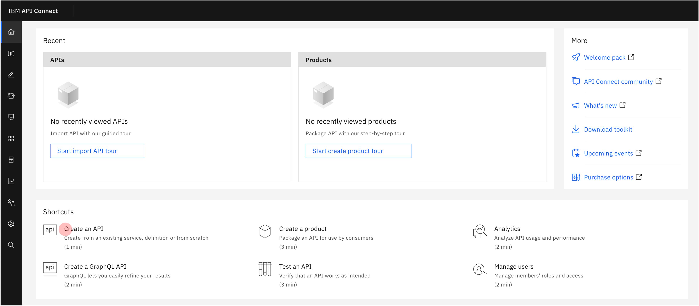
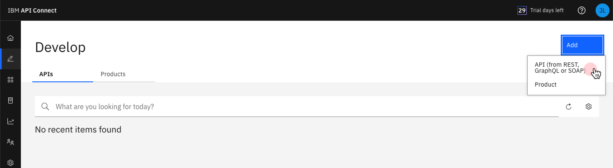
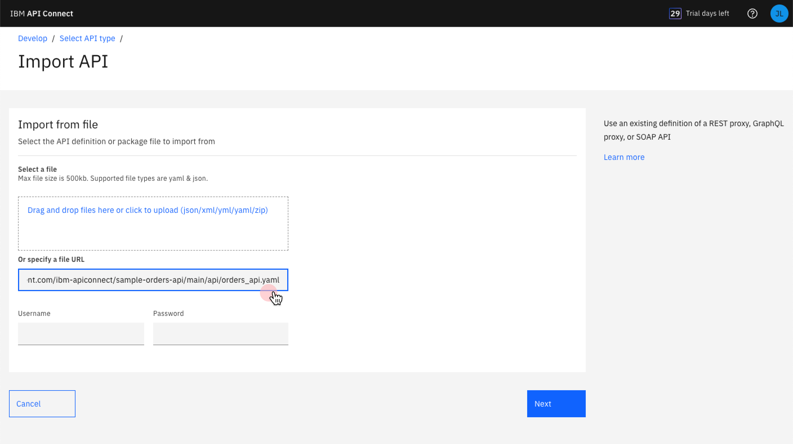
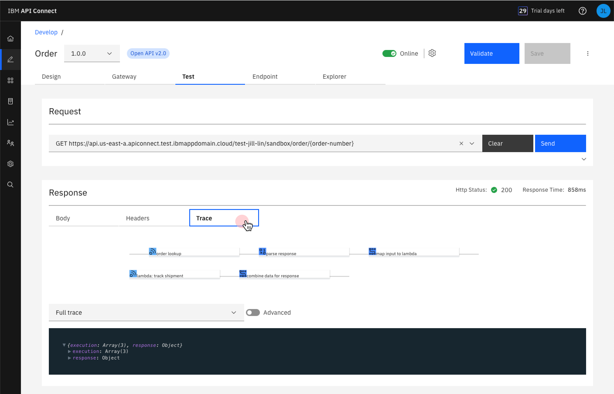

# API Sample: Order tracking

This git repo contains a sample API to use with API Connect.  If you want to try API Connect, you can [sign up for a free 30 day trial](https://register.automation.ibm.com/apic/trial/aws?source=github_sample) and import this API.

This document will guide you through the introductory/basic steps to import the sample API into your API Connect instance, create an API definition, and test the response of your API in order to validate the API returns what you expect.

## Introduction
### About this sample

We have all purchased something online where after your payment is processed, you receive a tracking number to track your package. This API demonstrates how you can build a composite API within API Connect that combines data from two different back-end sources -- our order fulfillment system and the delivery company’s shipment tracking -- to provide an order tracking API for App Developers to build on. 

This API takes the input of an order number and then uses it to query our mock internal order system to return the status of the order. Within the order status returned we have the details of which delivery company the parcel was shipped with and the associated tracking reference. The API then passes these to an AWS Lambda function to look up the parcel status from the appropriate shipping company. 

### Purpose of this tutorial:

This tutorial demonstrates how you can develop test, secure, socialize and analyze your API usage.

 - First, you will import the sample API into your API Connect instance and activate it.
 - Then, you will explore the API definition to see how it works.
 - Next, you will test the response of your API to validate that it works correctly.
 - Then you will add additional security to your API.
 - Then you will use the analytics feature to review and analyse your API's usage. 
 - Finally, you will use the API lifecycle features of API Connect to keep the API updated as your systems evolve.

### Demo Video

Before you begin, watch this [10 minute video](https://www.youtube.com/watch?v=xQXiiIXY0vU) to see how easy it is to create, test, secure and analyse your order tracking API with API Connect.

## Step by step guide:

Start to develop and test your API by completing the following 4 simple steps: 

### Step 1. Click here to access the [sample API definition](https://raw.githubusercontent.com/ibm-apiconnect/sample-orders-api/main/api/orders_api.yaml) 

 - Navigate to the API folder.
   

 - Open the “order_api.yaml” file and click "Raw". Copy the file's URL from the address bar:

    https://raw.githubusercontent.com/ibm-apiconnect/sample-orders-api/main/api/orders_api.yaml

### Step 2. Import the sample to your API Connect instance

 - Navigate to the API Connect Console at [APIC on AWS (US East)](https://api-manager.us-east-a.apiconnect.automation.ibm.com/manager/),  [APIC on AWS (Frankfurt)](https://api-manager.eu-central-a.apiconnect.automation.ibm.com/manager/) or  [APIC on AWS (London)](https://api-manager.eu-west-a.apiconnect.automation.ibm.com/manager/). (If you don't have an API Connect instance provisioned -  [sign up for a free 30 day trial now](https://register.automation.ibm.com/apic/trial/aws?source=github_sample))
 - In the homepage, select Develop APIs and products.
 
 
 - On the _Develop_ page, click Add and  select "_API (from REST, GraphQL or SOAP)_". 
  
 
 - On the _Select API type_ page, leave the OpenAPI 2.0 tab selected and under “_Import_”, select “_Existing OpenAPI_”. Click Next. 
  

 - In the "Or specify a file URL" field, paste the URL from Step 1.  Click Next. 
 - **Note:** if you have previously imported the same API you will need to delete it before importing it again.
   

 - Select “_Activate API_” to publish the API into the development sandbox so you can start testing it.  Click Next. 
   

 -  A summary displays the new API’s base endpoint URL as well as its application credentials; you won’t need those values for this tutorial.
 -  Select “_Edit API_” to open the API editor, where you can modify, publish, and test your API. 
  

### Step 3. Explore the API definition
You are now in the API Editor, where you can view and edit API definitions. 
  - The “Design” tab displays details about your API definition. The navigation list lets you easily drill down to each OpenAPI object in the definition. Click through the different objects in the navigation list to view the API’s definition, such as the operations it performs and the corresponding responses.
  

  - Select the “Gateway” tab to view the flow of "policies" (operations) in the API.
  
  - The policies used in an API are represented as a schematic in the API Assembler to show the order of execution; click any policy to view its details.
    The sample API uses the following policies: 
    - **order lookup**:  An invoke policy that calls the order fulfillment system to retrieve the order details for the provided order number (such as “order status” ,“ shipping carrier”, and “tracking number”). 
    - **parse response**:  The gateway parses the JSON response containing the order details so the values can be used later in the flow.
    - **map input to lambda**: Takes the “tracking number” and “shipping carrier” from the order details to build the input needed for invoking the AWS Lambda function in the next policy in the flow.
    - **lambda: track shipment**:  Calls the Lambda function to look up the tracking data for the retrieved tracking number and shipping carrier.
    - **combine data for response**: The map policy takes  the responses from “order lookup” and “lambda: track shipment” policies and combine them into a single output so when the customer calls this API, they get both the order details from the company order database and the shipping status from the carrier.

 

### Step 4: Test your API
Now, let's test it out:
  - Make sure your API shows as “_Online_”. If it’s offline, click the toggle to make your API online, which publishes it to the gateway so it’s available to use.
  - Select the "_Test_" tab to switch to the Test page.
  

  - In the “_Request_” section, type any value for the “_order-number_” field in the parameters list and click “_Send_”. 
  
 
  - You can now see the tracking details in the “Response” section, with:.
    - The order “created_at” date, “status”, and “shipped_at” date showing the data from the order fulfillment system
    - The "tracking_status" showing the data from the shipping company 
  
    
   
  - In the “Response” section, select the “Trace” tab to view how the API call was executed. Tracing the API’s execution helps when you need to debug your API. 
  

### Step 5: Add additional security requirements to your order tracking API.

 - In the “Design” tab under “Security Schemes”, you only have the Client ID configured, so let’s add a Client Secret as well. Click the + to add Client Secret to “Security Schemes”. 
 

 - Fill in the fields listed  below and click Create.
    - Security Definition Name (key) : use your own value  
    - Security Definition Type : apiKey
    - Key type : client_secret
    - Locate In: header
    - Variable name: write your own value

 - You can now see “Client ID” and “Client Secret” listed under "Security Schemes” in the navigation list. 

 - Scroll up and click “Security“ in the navigation list and select “edit icon” to edit this security requirement. 
 

 - At the moment only “ClientID” is selected so click “ClientSecret” to require the Client Secret as well, and then save the API. 
  

 - Click the Test tab, the Client ID and Client Secret are now displayed there. You can again provide any random value for the “order-number” field and click “Send” to run the test. You will see in the “Response Body” that the Client ID and Client Secret are used to make the request. 
   

 - To verify that this additional security header is required, delete the Client Secret row in the parameters section of the “Test” tab and click “Send” to invoke the API again. You can see in the “HTTP Status” and the “Response Body” that the request was denied with a “401 Unauthorized” error because you didn’t provide a Client Secret. 
   
   

### Step 6: Analyze your API calls and responses in the analytics dashboard. 

Click “Analytics” on the left navigation list. On the Analytics page, multiple dashboard options display. Click  each dashboard to explore it and gain insights into your API. 

**Note:** These dashboards will be more interesting and powerful once you get more and more API calls and responses logged. So to see more data in your dashboard, _use the Test tab to invoke your API a few times so you can generate some data for this step. Use several different order numbers, and then use one or two of those a couple times each._

  

API Dashboard:

 - Start by exploring the “API Dashboard”. This dashboard shows the API calls that were made within this your service instance. Display charts summarize total API calls, response codes, and response times. 
 

 - Click the "Discover” tab to see the individual API calls. Click each call to view the steps that the API executed. 
 
 

Product Dashboard:

 - Products is a way to group your APIs into a product so consumers can subscribe to your product which is a set up APIs. Displays chart show total API calls and application subscriptions per plan (plans determine access to APIs and manage API usage. 

Monitoring Latency Dashboard:

 - Displays charts containing response time statistics and data usage to help analyze performance when you have a lot of traffics. 

Monitoring Status Dashboard: 

 - Displays charts that show the response codes and success/failure rates of API calls.

Usage Dashboard: 

 - Displays charts that show the top 5 APIs, products, and applications.

Consumption Dashboard: 

Displays a chart showing the total API consumption in your service instance.

**DONE:** Great work! You just finished creating, testing, securing and analysing your order tracking sample API.  🎉🎉🎉 

## Next Steps

Now you have an API with which you can explore some of the other capabilities of API Connect.  We will be updating this guide with additional steps to help you perform the following advanced tasks:  

 - [**Secure**](https://www.ibm.com/docs/en/api-connect/saas?topic=apis-security-authentication) your API with additional security requirements such as OAuth
 - [**Automate**](automate.md)  your API deployment as part of a CI/CD pipeline
 - [**Socialize**](https://www.ibm.com/docs/en/api-connect/saas?topic=developer-portal-socialize-your-apis) your API  by sharing it with your customers in a Developer Portal

## Support
This is a publicly available sample and comes with no guarantees. At the time of publishing, the API Connect product and the sample API perform as described in this tutorial. If you have any questions, you can visit the [API Connect user community](https://ibm.biz/APIC_User_Community) page to read other users’ questions and ask your own questions.
