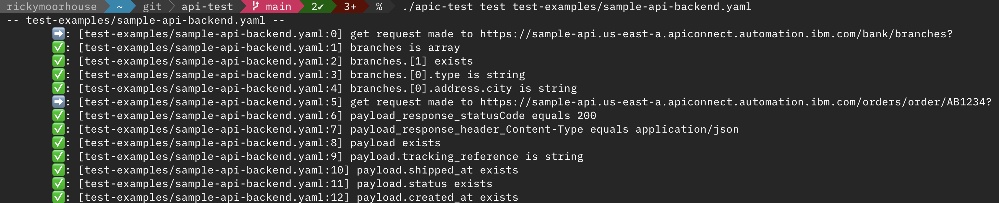

# API Testing CLI




 - Download and install apic toolkit [here](https://ibmdocs-test.dcs.ibm.com/docs/en/v10_CD_onprem_test?topic=toolkit-installing)
 - Create a yaml file to define your tests (see [example in test-examples/](./)) 
 - Run the CLI following the syntax to execute the tests:
```
api-test test {yaml-files}
```

## Test definition syntax

The test is defined as a yaml file with the following sections:

 - **requirements** - future use tbc.
 - **config** - future use - will contain default values for variables specified in file. 
 - **steps** - the flow for the test case - runs through the list of steps in order

Each step has a common set of parameters:

**type** - what type of step this is - currently supported: request, assert-is, assert-exists, assert-equal, assert-greater, each

### type: request
Make an HTTP(s) request 
 - method - the HTTP method to use
 - url - URL to make the request to
 - params - key value mapping of parameters to send 
 - headers - key value mapping of headers to send
 - var - name of variable to store the response in
 - mode - what type of data to expect and how to parse it (supported: json)

### type: assert-is
Assert that this variable from the response is of type `value`

 - expression - variable to run the test against
 - value - type we expect in response e.g. string, array


### type: assert-exists 
Assert that a particular variable specified in `expression` exists
N
### type: assert-equals 
Assert that a variable is equal to a value
 - expression - variable to test e.g. payload_response_statusCode
 - value - value to compare against e.g. 200

### type: assert-greater 
Assert that a variable is greater than a value
 - expression - variable to test e.g. payload.temperature
 - value - value to compare against e.g. 0

### type: assert-less
Assert that a variable is less than a value
 - expression - variable to test e.g. payload.temperature
 - value - value to compare against e.g. 0

### type: assert-in
Asserts that the element identified by a given expression matches at least one item from a given list.
 - expression - variable to test e.g. payload_response_statusCode
 - values - an array of values to compare against eg
 ```
 values:
    - 200
    - 201
 ```

### type: assert-matches
Asserts that the value of the element identified by a given expression matches a specified format.
 - expression - variable to test e.g. payload.zipcode
 - value - regex value to compare against e.g. [0-9]-[a-z]

### type: assert-compares
Asserts that two elements are equivalent in some way.
 - expression1 - Path to the first element for comparison e.g. payload1.temperature
 - expression2 - Path to the second element for comparison e.g. payload2.temperature

### type: assert-contains
Asserts that the value of the element identified by a given expression contains a specific substring.
 - expression - variable to test e.g. payload.country
 - value - substring to compare against e.g. abc

### type: each
Loop over the array referenced in expression carrying out the sub-steps for each item found e.g.

```yaml
  - type: each
    expression: "analytics.events"
    steps:
    - type: assert-exists 
      expression: _1.api_version
```

## Note

To know more about testing API's using apic toolkit, check out the documentation [here](https://ibmdocs-test.dcs.ibm.com/docs/en/v10_CD_onprem_test?topic=toolkit-installing)